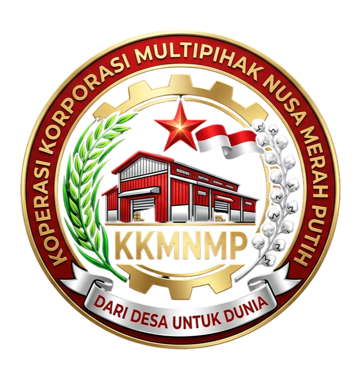

<div align="center">

<br/>



<br/>

# 🏛️ KMN BERDIKARI

### Koperasi Korporasi Multipihak Nusa Berdikari Merah Putih Indonesia

**_"Dari Desa untuk Dunia — Membangun Peradaban Ekonomi Digital Indonesia"_**

<br/>

[](https://nextjs.org/)
[](https://www.typescriptlang.org/)
[](https://tailwindcss.com/)
[](https://www.prisma.io/)
[](https://ui.shadcn.com/)
[](./LICENSE)

<br/>

[🌐 Website](https://kopnusa.id) ·
[📧 Email](mailto:info@kopnusa.id) ·
[📸 Instagram](https://instagram.com/kopnusa.id) ·
[🎥 YouTube](https://youtube.com/@kopnusa) ·
[💼 LinkedIn](https://linkedin.com/company/kopnusa)

<br/>

</div>

---

<table>
<tr>
<td width="50%">

## 🇮🇩 Tentang KMN BERDIKARI

**KMN BERDIKARI** adalah platform ekosistem koperasi digital terintegrasi yang menghubungkan **83.763 desa**, **5 Kelompok Pihak Anggota (KPA)**, dan **9 Pilar Kampung** dalam satu sistem ekonomi berdaulat.

Dibangun dengan teknologi terdepan — **Next.js 16**, **TypeScript**, **Tailwind CSS 4**, **Prisma ORM**, dan **shadcn/ui** — untuk mewujudkan visi Indonesia Emas 2045.

</td>
<td width="50%">

## 🔢 Angka-Angka Besar

| Metrik | Target |
|--------|--------|
| 🏡 Total Desa | **83.763** |
| 🏛️ Provinsi | **38** |
| 👥 Target Anggota | **10.000.000** |
| 💰 Target Transaksi | **Rp 2.000 Triliun** |
| 🌍 Negara Ekspor | **195** |
| 🏗️ 9 Pilar Program | **211** |
| 🤝 5 KPA | **6 Kelompok** |
| 🏆 7 Tier | **Rp100rb — Rp1M** |

</td>
</tr>
</table>

---

## ✨ Fitur Utama

<table>
<tr>
<td width="33%" align="center">

### 🏛️ Pentagon Kedaulatan

5 Kelompok Pihak Anggota (KPA) yang saling menopang dengan kekuatan suara proporsional

</td>
<td width="33%" align="center">

### 🏗️ 9 Pilar Kampung

211 program terinterlink dari Pemerintahan Digital sampai Kampung Wisata

</td>
<td width="33%" align="center">

### 🏪 Marketplace Zonasi

8 zona (AGRI, RETAIL, DIGITAL, HEALTH, SPIRITUAL, EXPORT, ENERGY, LOGISTICS)

</td>
</tr>
<tr>
<td width="33%" align="center">

### 💳 Pembayaran Midtrans

Snap Token, Virtual Account, QRIS, e-Wallet — terintegrasi penuh

</td>
<td width="33%" align="center">

### 📊 SHU Transparan

Distribusi Sisa Hasil Usaha yang adil dengan formula 6-arsip

</td>
<td width="33%" align="center">

### 🏡 Smart Village

Dashboard real-time integrasi 83.763 desa cerdas Indonesia

</td>
</tr>
<tr>
<td width="33%" align="center">

### 🚚 Logistik Digital

6+ kurir, kalkulator komisi, sistem keagenan terintegrasi

</td>
<td width="33%" align="center">

### 🎓 NB Academy

Pelatihan & sertifikasi digital untuk seluruh anggota

</td>
<td width="33%" align="center">

### 🌆 Nusa Futuristik

Visi kota masa depan di 4 tingkat: Provinsi, Kota, Kecamatan, Desa

</td>
</tr>
</table>

---

## 🛠️ Tech Stack

<table>
<tr>
<th align="center">🎨 Frontend</th>
<th align="center">⚙️ Backend</th>
<th align="center">🗄️ Database</th>
<th align="center">📦 Services</th>
</tr>
<tr>
<td>

| Teknologi | Versi |
|-----------|-------|
| Next.js (App Router) | 16.1 |
| TypeScript | 5.x |
| Tailwind CSS | 4.0 |
| shadcn/ui (New York) | Latest |
| Framer Motion | 12.x |
| Lucide React | 0.525 |
| React Hook Form | 7.x |
| Zod | 4.x |
| Zustand | 5.x |
| TanStack Query | 5.x |
| Recharts | 2.x |

</td>
<td>

| Teknologi | Versi |
|-----------|-------|
| Prisma ORM | 6.x |
| NextAuth.js | 4.x |
| Midtrans Client | 1.4 |
| Resend (Email) | 6.x |
| Sharp (Image) | 0.34 |
| bcrypt | 6.x |
| next-intl | 4.x |
| next-themes | 0.4 |
| MDX Editor | 3.x |
| @dnd-kit | 6.x/10.x |
| z-ai-web-dev-sdk | 0.0.17 |

</td>
<td>

| Teknologi | Fungsi |
|-----------|--------|
| SQLite | Dev Database |
| Prisma Client | ORM |
| 29 Models | Schema |
| Auto-seed | Data Awal |
| NIAK Generator | Nomor Anggota |
| Luhn Algorithm | Validasi |

</td>
<td>

| Service | Fungsi |
|---------|--------|
| Midtrans Snap | Payment Gateway |
| Resend | Email Delivery |
| NextAuth | Authentication |
| RBAC 10-level | Authorization |
| 40+ Permissions | Access Control |
| In-memory Cache | Performance |

</td>
</tr>
</table>

---

## 🚀 Quick Start

### Prasyarat

```bash
Node.js ≥ 18  ·  Bun ≥ 1.0  (recommended)  ·  Git
```

### Instalasi

```bash
# 1️⃣ Clone repository
git clone https://github.com/prabudanling/knmp.git
cd knmp

# 2️⃣ Install dependencies
bun install

# 3️⃣ Setup environment variables
cp .env.example .env
# Edit .env dengan konfigurasi Anda

# 4️⃣ Push database schema
bun run db:push

# 5️⃣ Seed database dengan data awal
bun run prisma/seed.ts

# 6️⃣ Jalankan development server
bun run dev
```

### 🎉 Selesai! Buka `http://localhost:3000`

### Login Admin Default

| | |
|---|---|
| 📧 Email | `admin@kmnmp.id` |
| 🔑 Password | `admin123` |

> ⚠️ **Ganti password default setelah login pertama!**

---

## ⚙️ Environment Variables

Buat file `.env` di root project:

```env
# ═══════════════════════════════════════
# 💾 DATABASE
# ═══════════════════════════════════════
DATABASE_URL="file:./db/custom.db"

# ═══════════════════════════════════════
# 🌐 APPLICATION
# ═══════════════════════════════════════
NEXT_PUBLIC_APP_URL="http://localhost:3000"
NEXT_PUBLIC_API_URL="http://localhost:3000"

# ═══════════════════════════════════════
# 💳 MIDTRANS PAYMENT GATEWAY
# ═══════════════════════════════════════
MIDTRANS_SERVER_KEY="SB-Mid-server-YOUR_KEY"
MIDTRANS_CLIENT_KEY="SB-Mid-client-YOUR_KEY"
# Set ke true untuk production
MIDTRANS_IS_PRODUCTION="false"

# ═══════════════════════════════════════
# 📧 EMAIL (Resend)
# ═══════════════════════════════════════
RESEND_API_KEY="re_YOUR_KEY"

# ═══════════════════════════════════════
# 🔐 AUTHENTICATION
# ═══════════════════════════════════════
NEXTAUTH_SECRET="your-super-secret-key-change-this"
NEXTAUTH_URL="http://localhost:3000"
```

---

## 📁 Struktur Proyek

```
knmp/
├── 📂 prisma/
│   ├── schema.prisma              # 29 database models
│   └── seed.ts                    # Initial data seeder
│
├── 📂 src/
│   ├── 📂 app/                    # Next.js App Router
│   │   ├── page.tsx               # Homepage (13 sections)
│   │   ├── layout.tsx             # Root layout + metadata
│   │   ├── globals.css            # Design system (975 lines)
│   │   │
│   │   ├── 📂 api/                # REST API Routes
│   │   │   ├── 📂 auth/           # Login, Register, Logout, Me
│   │   │   ├── 📂 pendaftaran/    # Registration + Status
│   │   │   ├── 📂 midtrans/       # Initiate + Callback
│   │   │   ├── 📂 niak/           # NIAK Validation
│   │   │   ├── 📂 tiers/          # Membership Tiers
│   │   │   ├── 📂 public/         # Public APIs (KPA, Tiers)
│   │   │   ├── 📂 health/         # Health Check
│   │   │   └── 📂 admin/          # Admin APIs
│   │   │       ├── 📂 dashboard/  # Stats & Charts
│   │   │       ├── 📂 pendaftaran/# Approve/Reject
│   │   │       ├── 📂 members/    # CRUD Members
│   │   │       ├── 📂 payments/   # Verify Payments
│   │   │       ├── 📂 shu/        # Calculate & Distribute
│   │   │       ├── 📂 announcements/ # CRUD
│   │   │       ├── 📂 settings/   # Config
│   │   │       └── 📂 activity-logs/ # Audit Trail
│   │   │
│   │   ├── 📂 daftar/             # Registration Page
│   │   ├── 📂 membership/         # Tiers Page
│   │   ├── 📂 pimpinan/           # Leadership Pages
│   │   │   ├── kornas/            # National
│   │   │   ├── korwil/            # Provincial
│   │   │   ├── korda/             # District
│   │   │   ├── korcam/            # Sub-district
│   │   │   └── kordes/            # Village
│   │   ├── 📂 nusa-futuristik/    # Future Cities
│   │   │   ├── provinsi/
│   │   │   ├── kota/
│   │   │   ├── kecamatan/
│   │   │   └── desa/
│   │   ├── 📂 pilar/              # 9 Pillars
│   │   │   └── [slug]/
│   │   ├── 📂 tentang/            # About
│   │   ├── 📂 marketplace/        # E-Commerce
│   │   ├── 📂 logistik/           # Logistics
│   │   ├── 📂 smart-village/      # Smart Village
│   │   ├── 📂 unit-usaha/         # Business Units
│   │   ├── 📂 academy/            # Learning
│   │   ├── 📂 shu/                # Profit Sharing
│   │   ├── 📂 rat/                # Annual Meeting
│   │   ├── 📂 dashboard/          # Member Dashboard
│   │   ├── 📂 admin/              # Admin Dashboard
│   │   ├── 📂 login/              # Authentication
│   │   └── 📂 ...                 # 20+ more pages
│   │
│   ├── 📂 components/
│   │   ├── 📂 ui/                 # 35+ shadcn/ui components
│   │   ├── 📂 layout/             # Header + Footer
│   │   ├── 📂 sections/           # 13 Homepage Sections
│   │   └── 📂 pilar/              # Pilar Page Content
│   │
│   ├── 📂 lib/                    # Server Utilities
│   │   ├── auth.ts                # SHA-256 Auth + Session
│   │   ├── db.ts                  # Prisma Client
│   │   ├── midtrans.ts            # Payment Integration
│   │   ├── niak.ts                # NIAK Generator (Luhn)
│   │   ├── permissions.ts         # 10-Role RBAC (40+ perms)
│   │   ├── resend.ts              # 4 Email Templates
│   │   ├── utils-server.ts        # Helpers + Cache + Stats
│   │   └── utils.ts               # cn() utility
│   │
│   ├── 📂 constants/              # Static Configuration
│   │   ├── site.ts                # Site Config + Nav
│   │   ├── colors.ts              # Full Color System
│   │   └── index.ts               # Re-exports
│   │
│   ├── 📂 data/                   # Static Data
│   │   ├── mocks/index.ts         # Mock Data (735+ lines)
│   │   ├── pilarPrograms.ts       # 211 Programs
│   │   └── founders.ts            # 17 Founders
│   │
│   ├── 📂 types/                  # TypeScript Types (425 lines)
│   ├── 📂 services/api/           # Client API Service
│   └── 📂 hooks/                  # React Hooks
│
├── 📂 public/                     # Static Assets
│   ├── 📂 images/people/          # 14 SVG Portraits
│   ├── logo-knmp.png
│   ├── logo-knmp-v2.png
│   └── favicon.ico
│
├── 📂 db/                         # SQLite Database
│   └── custom.db
│
└── 📂 docs/                       # Documentation
```

---

## 🗄️ Database Schema

> **29 Models** — Dari keanggotaan sampai distribusi SHU

<table>
<tr>
<th>🏗️ Core</th>
<th>🏢 Organization</th>
<th>💼 Business</th>
<th>💰 Finance</th>
<th>⚙️ System</th>
</tr>
<tr>
<td>

| Model | Key |
|-------|-----|
| **User** | NIAK, Email, Tier, KPA |
| **Tier** | 7 Levels (T1-T7) |
| **KPA** | 5 Groups + Voting |
| **Pendaftaran** | Registration Flow |
| **Payment** | Midtrans Integration |

</td>
<td>

| Model | Key |
|-------|-----|
| **Jabatan** | 5-Level Hierarchy |
| **DewanPendiri** | 17 Founders |
| **KoordinatorBidang** | 17 Divisions |
| **Korwil** | 8 Regions |
| **Provinsi** | 34 Provinces |
| **KabKota** | Districts |

</td>
<td>

| Model | Key |
|-------|-----|
| **Member** | Business Profile |
| **Product** | Marketplace Items |
| **Order** | Purchase Orders |
| **OrderItem** | Order Details |
| **Transaction** | Financial Flow |

</td>
<td>

| Model | Key |
|-------|-----|
| **SHUConfig** | 6-Arsip Formula |
| **SHUDistribution** | Per-Member Share |

</td>
<td>

| Model | Key |
|-------|-----|
| **Session** | Auth Tokens |
| **VerificationToken** | Email Verify |
| **NIAKSequence** | Auto-increment |
| **Setting** | App Config |
| **ActivityLog** | Audit Trail |
| **Notification** | User Alerts |
| **Announcement** | Broadcasts |
| **FAQ** | Knowledge Base |
| **SupportTicket** | Help Desk |
| **MemberCard** | Digital ID |
| **Document** | File Manager |

</td>
</tr>
</table>

---

## 🏛️ Pentagon Kedaulatan — 5 KPA

> Lima kelompok pemangku kepentingan yang membentuk fondasi kedaulatan ekonomi digital Indonesia

<table>
<tr>
<td width="20%" align="center">

### 🌾 Petani/Produsen
**KPA 1**

`#008F3D`

**Voting: 30%**

Petani, nelayan, pengrajin, peternak — pencipta nilai utama

</td>
<td width="20%" align="center">

### 🏪 Pengusaha
**KPA 2**

`#F59E0B`

**Voting: 20%**

Pedagang, pengepul, eksportir, UMKM — penghubung pasar

</td>
<td width="20%" align="center">

### 🤝 Koperasi
**KPA 3**

`#8B0000`

**Voting: 20%**

KDMP, BUMDes, KUD — entitas koperasi & badan usaha desa

</td>
<td width="20%" align="center">

### 👷 Pekerja/Kader
**KPA 4**

`#7C3AED`

**Voting: 15%**

Pegawai, agen logistik, kader digital — tulang punggung operasional

</td>
<td width="20%" align="center">

### 🛒 Konsumen
**KPA 5**

`#0EA5E9`

**Voting: 15%**

Pembeli retail, pengguna akhir — mesin permintaan pasar

</td>
</tr>
</table>

---

## 🏗️ 9 Pilar Kampung — 211 Program Terinterlink

> Sembilan pilar yang saling terhubung membentuk ekosistem kampung digital yang mandiri

| # | Pilar | Adhikara | Warna | Program |
|---|-------|----------|-------|---------|
| 1 | 🏛️ Pemerintahan Digital | Jnana | 🔵 | 20 |
| 2 | 💰 Kampung Modal | Artha | 🟡 | 20 |
| 3 | 🏭 Kampung Industri | Krada | 🔴 | 20 |
| 4 | 🌾 Kampung Pangan | Anna | 🟢 | 25 |
| 5 | 🏥 Kampung Sehat | Roga | 🩷 | 25 |
| 6 | 🎓 Kampung Cerdas | Vidya | 🟣 | 25 |
| 7 | 🏪 Kampung Niaga | Yana | 🟠 | 26 |
| 8 | 🌿 Kampung Hijau | Prakriti | 🩵 | 20 |
| 9 | ✈️ Kampung Wisata | Ramya | 🔵 | 30 |

**5 Tipe Interlink:** 🟢 Resource · 🟡 Capital · 🔵 Data · 🔴 Goods · 🟣 Services

---

## 🏆 7 Tier Keanggotaan

| Tier | Nama | Harga | Hak Utama | Warna |
|------|------|-------|-----------|-------|
| T1 | ⚪ Petani Digital | **Gratis** | Marketplace basic, harga pasar real-time | Gray |
| T2 | 🟢 Founding Member | **Rp 250.000** | Profil direktori, badge, voting Munas | Emerald |
| T3 | 🔵 Mitra Desa (KORDES) | **Rp 500.000** | Hak usaha, SHU penuh, mentorship | Sky |
| T4 | 🟣 Mitra Kecamatan (KORCAM) | **Rp 1.000.000** | Ekspor, branding, legal support | Violet |
| T5 | 🩷 Mitra Kabupaten (KORDA) | **Rp 2.500.000** | Dedicated manager, custom integration | Pink |
| T6 | 🟡 Mitra Provinsi (KORWIL) | **Rp 5.000.000** | Board meeting, strategic partnership | Gold |
| T7 | 🔴 Mitra Nasional (KORNAS) | **Rp 10.000.000** | Advisory board, equity options | Red |

---

## 🔐 Sistem Keamanan — 10-Level RBAC

```
Level 100  👑 SUPER_ADMIN    ═══  Akses penuh tanpa batasan
Level  90  🛡️ ADMIN          ═══  Kelola operasional
Level  80  🇮🇩 KORNAS         ═══  Pimpinan Nasional
Level  70  🏛️ KORWIL          ═══  Pimpinan Provinsi
Level  60  🏢 KORDA           ═══  Pimpinan Kabupaten
Level  50  🏘️ KORCAM          ═══  Pimpinan Kecamatan
Level  40  🏡 KORDES          ═══  Pimpinan Desa
Level  30  📋 KORBID          ═══  Koordinator Bidang
Level  20  👤 MEMBER          ═══  Anggota Biasa
Level  10  👁️ GUEST           ═══  Pengunjung
```

### 40+ Granular Permissions

| Domain | Permissions |
|--------|-------------|
| Dashboard | `view`, `manage` |
| Members | `list`, `create`, `edit`, `delete`, `approve`, `reject` |
| Pendaftaran | `list`, `review`, `approve`, `reject` |
| Payments | `list`, `verify`, `refund` |
| Products | `list`, `create`, `edit`, `delete`, `feature` |
| Orders | `list`, `process`, `cancel`, `refund` |
| SHU | `view`, `calculate`, `distribute` |
| Reports | `view`, `export`, `manage` |
| Settings | `view`, `manage` |
| Announcements | `list`, `create`, `edit`, `delete`, `publish` |
| Users | `list`, `create`, `edit`, `delete`, `change-role` |
| Audit | `view`, `export` |

---

## 🔢 Sistem NIAK — Nomor Induk Anggota Koperasi

> 16-digit identifier dengan Luhn checksum — kayak NISN-nya koperasi

```
┌────┬────┬─┬─┬──┬──┬───────┬─┐
│ PP │ KK │K│T│YY│MM│NNNNN  │C│
├────┼────┼─┼─┼──┼──┼───────┼─┤
│Prov│Kab │K│T│Th│Bn│No.Urut│∑│
│insi│/Kot│P│ir│un │ln│       │ │
│    │a   │A│  │   │  │       │ │
└────┴────┴─┴─┴──┴──┴───────┴─┘

Contoh: 31 71 2 3 26 04 00001 7
         │  │  │ │ │  │  │     └── Luhn Check Digit
         │  │  │ │ │  │  └── Nomor Urut (5 digit)
         │  │  │ │ │  └── Bulan (April)
         │  │  │ │ └── Tahun (2026)
         │  │  │ └── Tier 3 (Mitra Desa)
         │  │  └── KPA 2 (Pengusaha)
         │  └── Jakarta Selatan
         └── DKI Jakarta
```

---

## 💰 Sistem SHU — Sisa Hasil Usaha

> Bagi hasil transparan dengan formula 6-arsip yang adil

```
                    ┌─────────────────┐
                    │   TOTAL SHU     │
                    │  Rp 12,5 Miliar │
                    └────────┬────────┘
                             │
        ┌────────────────────┼────────────────────┐
        │                    │                     │
   ┌────┴────┐         ┌────┴────┐          ┌────┴────┐
   │ Dana    │         │ Jasa    │          │ Jasa    │
   │ Cadangan│         │ Usaha   │          │ Modal   │
   │  25%    │         │  45%    │          │  10%    │
   │         │         │         │          │         │
   │Untuk    │         │Dibagi   │          │Proporsi-│
   │darurat  │         │rata     │          │onal     │
   │& riset  │         │anggota  │          │simpanan │
   └─────────┘         └─────────┘          └─────────┘
        │                    │                     │
   ┌────┴────┐         ┌────┴────┐          ┌────┴────┐
   │ Riset   │         │ Sosial  │          │Insentif │
   │ Tekno   │         │ Peradaban│          │ Manajem │
   │  10%    │         │   5%    │          │   5%    │
   └─────────┘         └─────────┘          └─────────┘
```

---

## 💳 Alur Pembayaran — Midtrans Integration

```
┌──────────┐    ┌──────────┐    ┌──────────┐    ┌──────────┐    ┌──────────┐
│  Anggota  │───▶│  Server   │───▶│ Midtrans │───▶│  Payment │───▶│ Callback │
│  Daftar   │    │  Generate │    │  Snap    │    │  Page    │    │  Verify  │
│           │    │  Order    │    │  Token   │    │  (VA/QR) │    │  (SHA512)│
└──────────┘    └──────────┘    └──────────┘    └──────────┘    └──────────┘
                                                                      │
                                                                      ▼
                                                               ┌──────────┐
                                                               │  Update  │
                                                               │  Status  │
                                                               │ PAID ✓   │
                                                               └──────────┘
                                                                      │
                               ┌──────────────────────────────────────┘
                               ▼
                        ┌──────────┐    ┌──────────┐    ┌──────────┐
                        │  Email   │    │ Generate │    │ Notif    │
                        │  Konfirm │    │  NIAK    │    │  Admin   │
                        └──────────┘    └──────────┘    └──────────┘
```

**Metode Pembayaran:** 💳 Virtual Account · 📱 QRIS · 💳 Kartu Kredit · 👛 e-Wallet · 🏦 Bank Transfer

---

## 🎨 Design System

### Brand Colors

| Warna | Hex | Digunakan |
|-------|-----|-----------|
| 🟢 **Hijau PPP** | `#008F3D` | Primary CTA, link, badge positif |
| 🔴 **Merah Tua** | `#8B0000` | Judul seksi, tombol sekunder, aksen |
| 🟡 **Emas** | `#D4AF37` | Badge premium, garis dekoratif |
| ⚫ **Soft Black** | `#1A1A1A` | Teks utama |
| ⚪ **White** | `#FFFFFF` | Background |

### Visual Effects

| Efek | Class | Penjelasan |
|------|-------|------------|
| 🪟 Glassmorphism | `.glass` | Kaca buram transparan |
| ✨ Glow Hijau | `.glow-green` | Cahaya hijau di sekitar elemen |
| ✨ Glow Merah | `.glow-maroon` | Cahaya merah di sekitar elemen |
| 🎴 3D Tilt | Framer Motion | Kartu miring mengikuti mouse |
| ✨ Partikel | Custom | Bintik-bintik melayang |
| 🌊 Gradient | `.hero-gradient` | Gradien warna bergerak |

---

## 📡 API Endpoints

### 🔓 Public APIs

| Method | Endpoint | Deskripsi |
|--------|----------|-----------|
| `GET` | `/api/health` | Health check + DB status |
| `GET` | `/api/public/tiers` | List membership tiers |
| `GET` | `/api/public/kpa` | List KPA categories |
| `POST` | `/api/auth/register` | Register new member |
| `POST` | `/api/auth/login` | Login & get token |
| `GET` | `/api/auth/me` | Get current user profile |
| `POST` | `/api/auth/logout` | Destroy session |
| `POST` | `/api/pendaftaran` | Submit registration |
| `GET` | `/api/pendaftaran/status/[no]` | Check registration status |
| `GET` | `/api/tiers` | List tiers (alternate) |
| `GET` | `/api/niak/[niak]` | Validate NIAK (Luhn) |
| `POST` | `/api/midtrans/initiate` | Create Snap payment |
| `POST` | `/api/midtrans/callback` | Midtrans webhook |

### 🔒 Admin APIs (Requires Auth)

| Method | Endpoint | Deskripsi |
|--------|----------|-----------|
| `POST` | `/api/admin/login` | Admin login |
| `GET` | `/api/admin/dashboard/stats` | Dashboard statistics |
| `GET` | `/api/admin/pendaftaran` | List registrations |
| `GET` | `/api/admin/pendaftaran/[id]` | Registration detail |
| `POST` | `/api/admin/pendaftaran/[id]/approve` | Approve registration |
| `POST` | `/api/admin/pendaftaran/[id]/reject` | Reject registration |
| `GET` | `/api/admin/members` | List members |
| `POST` | `/api/admin/members` | Create member |
| `GET` | `/api/admin/payments` | List payments |
| `POST` | `/api/admin/payments/[id]/verify` | Verify payment |
| `GET` | `/api/admin/shu` | List SHU configs |
| `POST` | `/api/admin/shu` | Create SHU config |
| `POST` | `/api/admin/shu/calculate` | Calculate distribution |
| `POST` | `/api/admin/shu/distribute` | Execute distribution |
| `GET` | `/api/admin/announcements` | List announcements |
| `POST` | `/api/admin/announcements` | Create announcement |
| `GET` | `/api/admin/settings` | Get settings |
| `PUT` | `/api/admin/settings` | Update settings |
| `GET` | `/api/admin/activity-logs` | Audit trail |

---

## 📜 NPM Scripts

| Script | Perintah | Fungsi |
|--------|----------|--------|
| 🚀 Dev | `bun run dev` | Start development server (port 3000) |
| 📦 Build | `bun run build` | Production build |
| ▶️ Start | `bun run start` | Start production server |
| 🔍 Lint | `bun run lint` | Run ESLint |
| 💾 DB Push | `bun run db:push` | Push schema ke database |
| ⚙️ DB Generate | `bun run db:generate` | Generate Prisma Client |
| 🔄 DB Migrate | `bun run db:migrate` | Create migration |
| 🗑️ DB Reset | `bun run db:reset` | Reset database |

---

## 🚀 Deployment

### Vercel (Recommended)

```bash
bun run build
vercel --prod
```

### Docker

```dockerfile
FROM node:18-alpine
WORKDIR /app
COPY . .
RUN bun install
RUN bun run build
EXPOSE 3000
CMD ["bun", "run", "start"]
```

### cPanel / Shared Hosting

```bash
bun run build
# Upload .next/ + public/ + package.json
# Start via Node.js selector
```

---

## 📊 Homepage Architecture — 13 Sections

```
┌─────────────────────────────────────────────────────────┐
│                    🏛️ HEADER                            │
│  Beranda · Tentang · Nusa Futuristik · 9 Pilar ·       │
│  Pimpinan · Layanan                                    │
├─────────────────────────────────────────────────────────┤
│                                                         │
│  🌟 1. HERO — Luxury particles, 3D stat cards,         │
│     simpanan section, Navigasi Peradaban CTA            │
│                                                         │
│  🔭 2. VISI MISI — 10 dimensi, glassmorphism quote,    │
│     roadmap 2026-2045                                   │
│                                                         │
│  📊 3. STATISTIK — 6 luxury stat cards with animated   │
│     counters + gold flash                               │
│                                                         │
│  🏗️ 4. 9 PILAR — Kampung interlink diagram,            │
│     211 programs, modal expansion                       │
│                                                         │
│  🛡️ 5. PENTAGON KEDAULATAN — 5 KPA detail,             │
│     voting power, franchise tiers                       │
│                                                         │
│  🏢 6. UNIT USAHA — 11 business units grid             │
│                                                         │
│  🏪 7. MARKETPLACE — 8 zones, products, certifications │
│                                                         │
│  🚚 8. LOGISTIK — Commission calculator, partners      │
│                                                         │
│  🏡 9. SMART VILLAGE — Dark dashboard mockup           │
│                                                         │
│  🔢 10. CARA KERJA — 5-step timeline                   │
│                                                         │
│  💬 11. TESTIMONI — 3 testimonials + partners           │
│                                                         │
│  ❓ 12. FAQ — 5 accordion items                         │
│                                                         │
│  🎯 13. CTA — "Jadilah Bagian dari Peradaban Baru"     │
│                                                         │
├─────────────────────────────────────────────────────────┤
│                    📋 FOOTER                             │
│  Newsletter · Stats · Links · Legal · Social            │
└─────────────────────────────────────────────────────────┘
```

---

## 🌆 Nusa Futuristik — Kota Masa Depan

| Tingkat | Halaman | Sub-Halaman |
|---------|---------|-------------|
| 🏛️ **Provinsi** | `/nusa-futuristik/provinsi` | 7 kawasan |
| 🏢 **Kota** | `/nusa-futuristik/kota` | 7 kawasan |
| 🏘️ **Kecamatan** | `/nusa-futuristik/kecamatan` | 7 kawasan |
| 🏡 **Desa** | `/nusa-futuristik/desa` | 7 kawasan |

**7 Kawasan per tingkat:** Kawasan Pangan Terpadu · Kawasan Industri Terpadu · Wisata Terpadu · Transportasi Digital · Kampung Modal · Proyek Strategis · Rumah Produktif

---

## 📈 Performance Targets

| Metrik | Target | Tool |
|--------|--------|------|
| 🟢 Lighthouse Performance | **> 90** | Chrome DevTools |
| 🟢 Lighthouse Accessibility | **100** | Chrome DevTools |
| 🟢 Lighthouse Best Practices | **100** | Chrome DevTools |
| 🟢 Lighthouse SEO | **> 95** | Chrome DevTools |
| ⚡ First Contentful Paint | **< 1.5s** | Web Vitals |
| ⚡ Largest Contentful Paint | **< 2.5s** | Web Vitals |
| 📦 Bundle Size | **< 500KB** | Next.js Build |
| 🚀 API Response | **< 200ms** | Server Logs |

---

## 🗺️ Roadmap

<table>
<tr>
<th>🔴 Phase 1 — Fondasi</th>
<th>🟡 Phase 2 — Kualitas</th>
<th>🟢 Phase 3 — Peningkatan</th>
<th>🔵 Phase 4 — Skala</th>
</tr>
<tr>
<td>

- [x] Next.js 16 Setup
- [x] Prisma Schema (29 models)
- [x] 13 Homepage Sections
- [x] Midtrans Integration
- [x] NIAK Generator
- [x] 10-Level RBAC
- [x] Email Templates
- [ ] Security Hardening
- [ ] Rate Limiting
- [ ] bcrypt Migration

</td>
<td>

- [ ] Component Decomposition
- [ ] Dark Mode Toggle
- [ ] Data Mock → API Real
- [ ] Loading States
- [ ] Image Optimization
- [ ] sitemap.xml
- [ ] Mobile Responsive Fix
- [ ] WCAG Contrast Fix

</td>
<td>

- [ ] PWA Support
- [ ] Unit Testing
- [ ] Aksesibilitas (a11y)
- [ ] Structured Data (JSON-LD)
- [ ] Real Photos
- [ ] Video Gallery
- [ ] Real-time Notifications
- [ ] Multi-language (ID/EN)

</td>
<td>

- [ ] Laravel Backend
- [ ] MySQL Migration
- [ ] Redis Caching
- [ ] WebSocket Service
- [ ] Mobile App (React Native)
- [ ] AI Chatbot
- [ ] Blockchain Verification
- [ ] Carbon Credit Marketplace

</td>
</tr>
</table>

---

## 👥 Tim

| Peran | Anggota |
|-------|---------|
| 🏛️ Pendiri & Ketua | Prof. Dr. H. Anwar Sanusi, SH, S.Pel, MM |
| 🧠 Master Polymath | Full-Stack Developer / System Architect |
| 🤖 AI Partner | PT DIGIMAN |
| 🏗️ Developer | Open Source Contributors |

---

## 🤝 Kontribusi

Kami meng欢迎 (mengwelcome) kontribusi dari siapa saja! 🇮🇩

```bash
# 1. Fork repository
# 2. Buat branch fitur
git checkout -b fitur/nama-fitur

# 3. Commit perubahan
git commit -m "✨ Tambah fitur baru"

# 4. Push ke branch
git push origin fitur/nama-fitur

# 5. Buat Pull Request
```

---

## 📄 Lisensi

Dilisensikan di bawah **MIT License** © 2024–2026 KMN BERDIKARI

---

<div align="center">

<br/>

### 🇮🇩 _"Dari Desa untuk Dunia — Membangun Peradaban Ekonomi Digital Indonesia"_

<br/>

**KMN BERDIKARI** · Koperasi Korporasi Multipihak Nusa Berdikari Merah Putih Indonesia

[🌐 kopnusa.id](https://kopnusa.id) · [📧 info@kopnusa.id](mailto:info@kopnusa.id) · [📸 @kopnusa.id](https://instagram.com/kopnusa.id)

<br/>

<sub>Built with ❤️ using Next.js 16 · TypeScript · Tailwind CSS 4 · Prisma · shadcn/ui</sub>

<sub>© 2024–2026 KMN BERDIKARI. All rights reserved.</sub>

</div>
